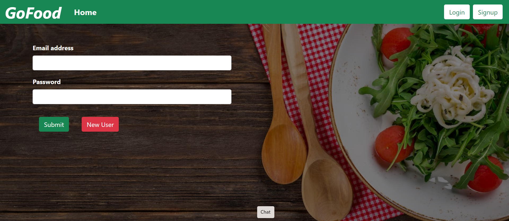
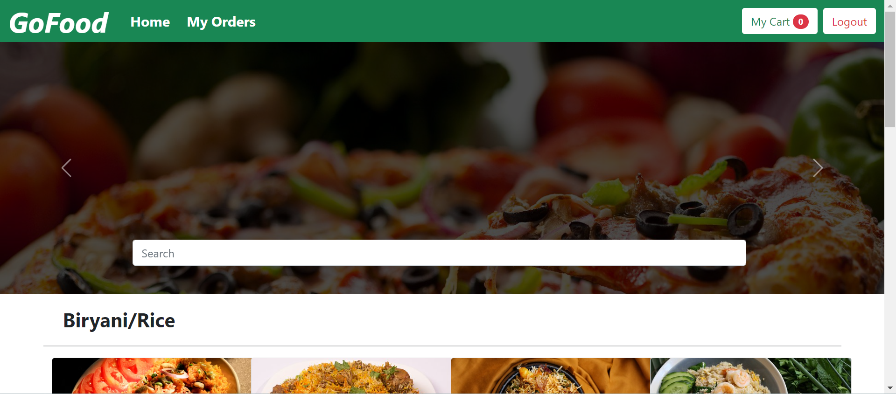
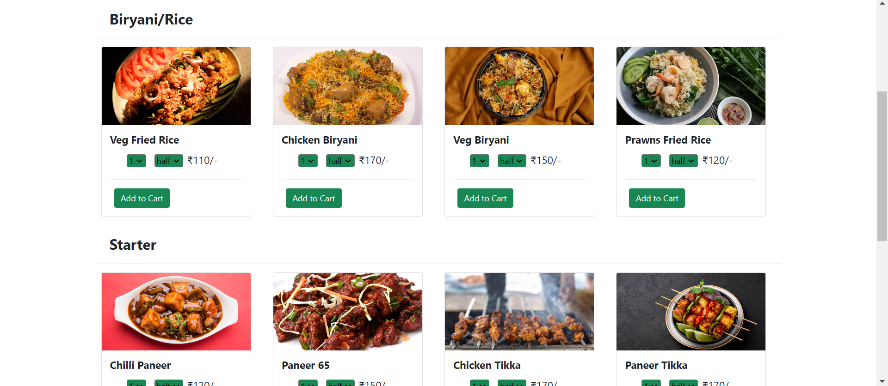
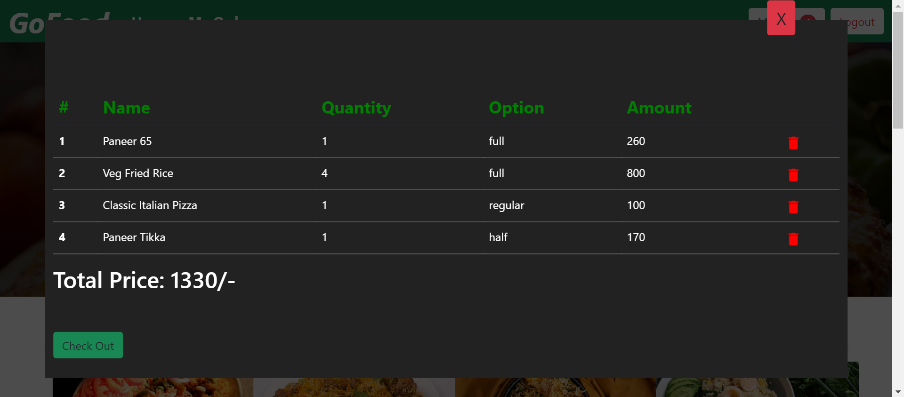

# Food Delivery App

A Food Delivery app that allows users to browse food items, add them to their cart, and place orders.

## Table of Contents

- [App Overview](#app-overview)
- [Features](#features)
- [Technologies](#technologies)
- [Getting Started](#getting-started)
- [Screenshots](#screenshots)

## App Overview

The Food Delivery App provides a convenient way for users to order their favorite food items. Users can browse a menu, add items to their cart, and place an order for delivery.

## Features
- Browse food items by category.
- Search for specific food items.
- Add items to the cart.
- Adjust quantities of items in the cart.
- View and modify the cart.
- Place an order for delivery.

## Technologies

- **Frontend**: React, HTML, CSS (or CSS-in-JS solutions), etc.
- **Backend**: Node.js, Express.js, MongoDB.
- **Authentication**: JSON Web Tokens (JWT).

## Getting Started

# Prerequisites

- Node.js (install from https://nodejs.org/)
- MongoDB (install from https://www.mongodb.com/)

# Installation

1. Clone the repository:

   ```bash
   git clone https://github.com/adityaChauhan2510/Go-Food.git
   cd Go-Food

2. Install dependencies:
   npm install

3. Running the App

   @Run the backend server:
     npx nodemon
   
   @Run the React Development server:
     npm run client

5. The app should now be accessible at http://localhost:3000.

## Screenshots






